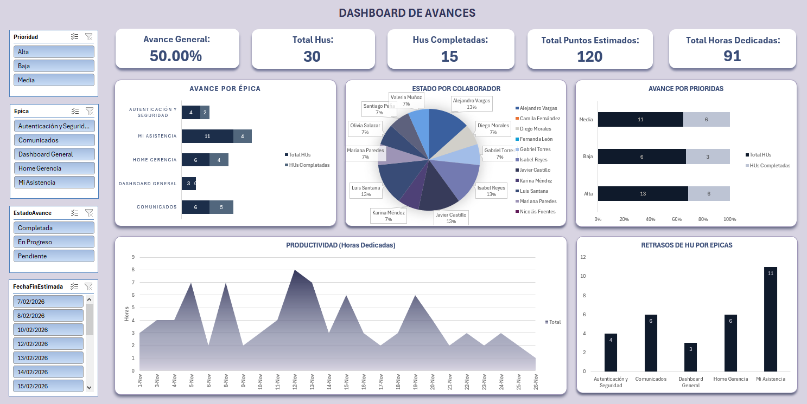

# Dashboard de Gestión de Avances y Productividad - Seguimiento de Épicas y Equipo

## Descripción General
Este repositorio contiene un **dashboard interactivo en Excel** para el seguimiento y gestión de avances de un equipo de desarrollo. La herramienta permite monitorear el progreso de épicas, productividad por colaborador, horas dedicadas, retrasos y estado de tareas, facilitando la toma de decisiones en la gestión de proyectos.



## Características Principales

- **KPIs de Proyecto:** Avance General (50%), Total HUs (30), HUs Completadas (15), Total Puntos Estimados (120), Total Horas Dedicadas (91).
- **Avance por Épica:** Seguimiento detallado de HUs totales vs completadas por épica.
- **Estado por Colaborador:** Matriz de avance individual con recuento de tareas Completadas, En Progreso y Pendientes por cada miembro del equipo.
- **Productividad Diaria:** Tracking de horas dedicadas por día (1-Nov a 26-Nov) para análisis de capacidad y rendimiento.
- **Avance por Prioridad:** Distribución de HUs totales vs completadas segmentadas por prioridad (Alta, Media, Baja).
- **Retrasos por Épica:** Identificación de HUs con fecha de vencimiento, para gestión de riesgos y cuellos de botella.
- **Detalle de HUs:** Listado completo de historias de usuario con puntos estimados por cada una.

## Objetivo del Proyecto
Desarrollar una solución de **seguimiento de proyectos (Project Tracking)** en Excel que permita visualizar el estado real del equipo, identificar desviaciones y optimizar la asignación de recursos basado en datos de avance y productividad.

## Objetivos del Proyecto
- **Consolidación de Datos:** Integrar información de HUs, épicas, colaboradores, tiempos y estados en un modelo único.
- **Métricas de Avance:** Calcular % de avance real vs esperado, productividad por colaborador y eficiencia por épica.
- **Visualización de Estado:** Crear vistas rápidas de estado por colaborador y épica para reuniones de seguimiento (daily/scrum).
- **Detección de Riesgos:** Identificar retrasos, baja productividad y tareas estancadas para acciones correctivas tempranas.

## Insights Clave para el Negocio
- **Avance General 50% vs Horas Dedicadas 91:** Relación horas vs avance → **Análisis de eficiencia:** Validar si 91 horas para 50% de avance está dentro del esfuerzo estimado.
- **Productividad por Colaborador:** Equipo de 16 personas con 15 HUs completadas y 11 en progreso **Work in Progress (WIP) alto:** Posible multitasking o dependencias no resueltas.
- **Horas Pico vs Promedio:** Días con 8 horas (12-Nov) vs días con 1 hora (26-Nov) **Análisis de capacidad:** Identificar patrones de baja productividad para ajustar expectativas.
- **Prioridad Alta:** 13 HUs totales, solo 6 completadas (46%) **Riesgo en entregables críticos:** Enfocar esfuerzos en desbloquear tareas de alta prioridad.
- **Retrasos por Épica:** Mi Asistencia (11 HUs) y Comunicados (6 HUs) con mayor volumen **Posible cuello de botella:** Requiere revisión de asignación de recursos.

## Pasos Involucrados
1. **Extracción y Preparación de Datos:** Consolidación de HUs, épicas, colaboradores, estados, fechas y horas desde fuentes de tracking (Jira/Trello/Excel manual).
2. **Modelado en Excel:** Creación de tablas dinámicas para avance por épica, estado por colaborador, productividad diaria y prioridades.
3. **Cálculo de Métricas:** Implementación de fórmulas para % avance, HUs completadas vs totales, puntos estimados y retrasos.
4. **Visualización y Dashboard:** Diseño de interfaz con KPIs, matrices de estado, gráficos de productividad y segmentadores para filtrado dinámico.

## Habilidades Demostradas
- **Gestión de Proyectos (Project Tracking):** Seguimiento de HUs, épicas y avance por prioridad.
- **Análisis de Productividad:** Evaluación de horas dedicadas vs avance real por colaborador y día.
- **Excel Avanzado:** Tablas dinámicas, segmentadores, formato condicional, funciones de agregación.
- **Business Intelligence Aplicado a Proyectos:** KPIs de salud de proyecto, detección de riesgos y cuellos de botella.
- **Visualización de Datos de Equipo:** Matrices de estado por colaborador y épica para decisiones tácticas.

## Funciones y Técnicas Utilizadas
- **Tablas Dinámicas:** Para resumir HUs por épica, colaborador, prioridad y fecha.
- **Segmentadores:** Filtros interactivos para análisis por épica, colaborador, prioridad y estado.
- **Fórmulas:** `CONTAR.SI.CONJUNTO`, `SUMAR.SI.CONJUNTO`, `BUSCARV` para cálculos de avance y retrasos.
- **Gráficos de Barras y Líneas:** Visualización de productividad diaria y comparativas por épica.

## Empezando
```bash
git clone https://github.com/tuusuario/Dashboard-Gestion-Avances-Productividad-Equipo.git

1.Abrir el archivo dashboard reporte de avances.xlsx en Excel 2016 o superior.
Explorar las pestañas: Dashboard principal, Base de Datos HUs, Tablas Dinámicas.
Usar los segmentadores para filtrar por épica, colaborador, prioridad o estado.
